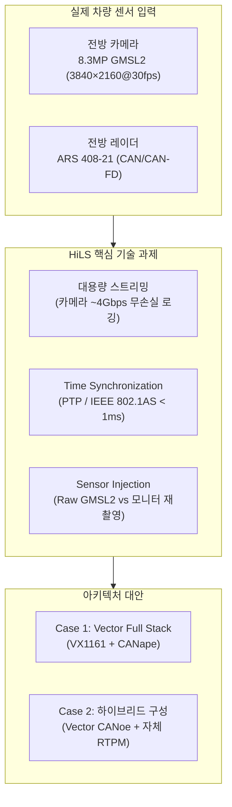
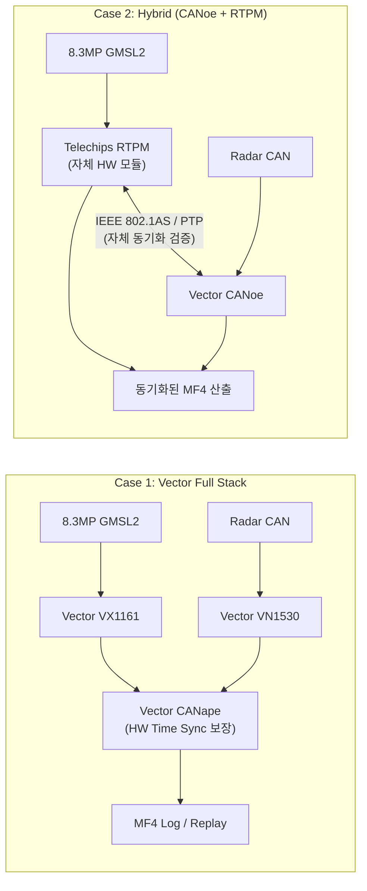

전방 8.3MP 카메라와 레이더 데이터를 실차 없이 재현·검증하기 위해, 초당 수 기가비트(Gbps) 영상 대역폭과 CAN 신호 간 마이크로초 단위 시간 동기화(Time Sync)를 달성하고 상용 장비와 자체 자산 간 최적의 HiLS 아키텍처를 도출한 엔지니어링 의사결정 과정을 공유합니다.

## 1. 배경: 왜 글로벌 Tier-1 협업에서 실차 시험 대신 HiLS가 필수적인가?

자율주행 및 ADAS 시스템 개발에서 기능 검증의 최종 단계는 언제나 실차 시험(Field Operational Test)이었습니다. 그러나 센서 해상도가 8.3MP(3840×2160, 4K)로 고도화되고 글로벌 협업(예: 국내 SoC 개발사, 유럽/싱가포르 Tier-1 제어기 개발사, 공인 인증기관)이 보편화된 현재, 실차 시험에만 의존하는 방식은 명확한 한계에 부딪힙니다.

1. **지리적 격차와 물리적 비용**: 테스트용 차량과 시제품 SoC 보드를 해외 연구소로 매번 항공 운송하고 현지 인허가를 취득하는 데 수개월의 시간과 막대한 비용이 소모됩니다.
2. **테스트 시나리오의 재현성(Reproducibility) 결여**: 악천후, 역광, 돌발 보행자 등 위험한 엣지 케이스(Edge Case)를 실제 도로에서 동일한 조건으로 반복 검증하는 것은 불가능에 가깝습니다.
3. **초고용량 센서 데이터 전송 장벽**: 8.3MP 카메라 1대가 30fps 비압축(YUV422)으로 뿜어내는 원시 데이터는 초당 약 **3.98 Gbps**에 달합니다. 레이더의 CAN/CAN-FD 신호와 함께 이 데이터를 실시간으로 손실 없이 기록하고 재생하는 것은 일반 PC나 네트워크로는 불가능합니다.

이러한 물리적 한계를 극복하고 해외 파트너(Aumovio 등)가 싱가포르 현지 연구실에서 한국의 도로 주행 환경을 100% 동일하게 검증할 수 있도록, **하드웨어 기반 원격 시뮬레이션 인프라인 HiLS(Hardware-in-the-Loop Simulation)** 환경 구축이 핵심 엔지니어링 과제로 대두되었습니다.

---

## 2. 핵심 난제: 센서 융합의 성패를 가르는 시간 동기화(Time Synchronization)

카메라-레이더 센서 융합(Sensor Fusion) 기반의 전방 충돌 경고(FCWS) 및 자동 긴급 제동(AEBS) 시스템에서 가장 치명적인 문제는 **카메라 프레임과 레이더 타겟 간의 시간 드리프트(Time Drift)**입니다.

시속 100km/h(약 27.8m/s)로 주행 중인 상황을 가정해 보겠습니다.
카메라와 레이더의 타임스탬프가 단 **50ms**만 어긋나도, 두 센서가 인식한 전방 차량의 상대 거리는 **약 1.39m의 오차**를 발생시킵니다.

$$ \Delta d = v_{rel} \times \Delta t $$

이 1.39m의 오차는 FCWS 경보 시점을 지연시키거나, 급제동 임계값(TTC, Time-to-Collision) 계산에 심각한 오류를 유발하여 유령 제동(Phantom Braking) 또는 미작동 사고로 이어집니다.

따라서 HiLS 환경에서 실차 로그 데이터를 리플레이할 때 만족해야 하는 동기화 기준은 다음과 같습니다:
- **센서 간 동기화 정밀도**: $\le 1\text{ ms}$ (권장: 마이크로초 단위)
- **프레임 지터(Jitter)**: $\le \pm 0.5\text{ ms}$
- **타임스탬프 무결성**: 카메라 프레임 노출 시점(Exposure Start)과 레이더 CAN 메시지 송신 시점의 글로벌 클럭 동기화

---

## 3. 아키텍처 대안 비교: 상용 풀스택 vs 자체 자산(RTPM) 하이브리드

HiLS 시스템을 구축할 때 마주한 가장 큰 의사결정은 **"모든 것을 검증된 상용 솔루션으로 일괄 구매할 것인가"**, 아니면 **"자체 개발 자산(RTPM)을 활용해 커스텀 하이브리드 시스템을 구축할 것인가"**였습니다. 글로벌 계측 장비 전문 기업인 Vector사와의 심층 기술 협상을 통해 두 가지 아키텍처 후보를 도출하고 다각도로 비교 검증했습니다.

| 비교 항목 | Case 1. Vector Full Stack (VX1161 + CANape) | Case 2. Hybrid (Vector CANoe + Telechips RTPM) |
| :--- | :--- | :--- |
| **카메라 인터페이스** | Vector VX1161 (GMSL2 전용 HW 스트리밍) | Telechips RTPM (자체 개발 캡처/스트리밍 보드) |
| **CAN/레이더 인터페이스**| Vector VN1530 | Vector CANoe / VN 계열 |
| **Time Sync 보장성** | **Vector 하드웨어 타이머 보장 (PTP/IEEE 1588)** | **보장 미제공 → PTP 스택 자체 설계 및 검증 필수** |
| **도입 리드타임** | 즉시 도입 가능 (발주 후 약 3~4개월 납기) | **최소 4개월 이상 (인터페이스 개발 및 드라이버 포팅)** |
| **소프트웨어 라이선스** | CANape Option Driver Assistance (고가) | CANoe 기존 보유 라이선스 활용 가능 |
| **비용 구조 (추정치)** | Logging 약 66.6M / Replay 약 36.9M KRW | Logging 약 30M+자체공수 / Replay 0~30M KRW |
| **핵심 기술 리스크** | 고비용 예산 확보 부담, 전용 HW 납기 지연 | **PTP 동기화 오차 검증 부담, 유지보수 공수 발생** |

### 의사결정의 핵심 포인트
- **Case 1 (Vector Full Stack)**은 하드웨어 수준에서 FPGA 기반 PTP 타임스탬핑을 완벽히 지원하여 데이터 무결성을 100% 보장합니다. 인증기관(KATECH) 및 글로벌 Tier-1에 제출할 인증 데이터의 공신력이 최우선이라면 가장 안전한 선택입니다.
- **Case 2 (Hybrid Architecture)**는 자체 개발한 실시간 프로세싱 모듈(RTPM)을 활용하여 하드웨어 도입 비용을 절반 이하로 대폭 절감할 수 있습니다. 다만, RTPM과 CANoe 간의 시간 동기화를 위해 Linux PTP(PTP4L) 및 하드웨어 타임스탬프 인터페이스를 엔지니어가 직접 튜닝하고 오차를 증명해야 하는 기술적 부채를 수반합니다.

---

## 4. 인젝션 방식의 딜레마: Raw GMSL2 직결 vs 모니터 재촬영 방식

HiLS 시스템 구축 논의 중 가장 치열했던 기술 쟁점은 **시뮬레이션 영상을 카메라 센서에 어떻게 입력할 것인가**였습니다.

### 4.1 모니터 재촬영(Monitor Re-capture) 방식의 함정과 대응
일부 테스트 환경에서는 3D 시뮬레이터(CarMaker, Carla 등)가 렌더링한 모니터 화면 앞에 실제 전방 카메라를 거치하고 영상을 재촬영하는 방식을 제안했습니다. 그러나 이는 양산급 ADAS 검증에서 다음과 같은 심각한 왜곡을 낳습니다:
- **플리커(Flicker) 및 주사율 불일치**: 모니터의 리프레시율(60Hz/120Hz)과 카메라 셔터 속도 간의 위상차로 인해 화면에 검은 롤링 바가 발생하여 객체 탐지율이 급락함.
- **광학 왜곡 및 렌즈 색수차 이중 발생**: 시뮬레이터의 가상 카메라 왜곡 위에 실제 물리 렌즈의 왜곡이 중첩됨.
- **SoC 인지 로직의 AppStatus 헤더 설계**: 주행 중이 아닌 정지 상태에서 모니터 영상만 재생할 경우, 차량 Gear 상태(Park/Drive) 및 차속 신호가 0이 되어 SoC 내부의 안전 필터링 알고리즘이 Perception 출력을 차단하는 문제가 발생합니다. 이를 해결하기 위해 차량 상태와 무관하게 인지 스트림을 강제 바이패스하는 `AppStatus` 헤더 프로토콜을 정의하고 KATECH·Aumovio와 합의를 이끌어냈습니다.

### 4.2 Raw GMSL2 직결(Direct Injection) 방식의 우수성
궁극적인 해결책은 디시리얼라이저(De-serializer) 보드를 통해 GPU가 렌더링한 가상 프레임을 RAW 포맷(Bayer pattern)으로 변환한 뒤, 카메라 센서 헤드를 거치지 않고 **SoC의 MIPI-CSI2 수신단으로 직접 주입**하는 것입니다. 
이 방식을 통해 조명이나 렌즈 오차 없이 완벽히 결정론적(Deterministic)인 센서 데이터를 공급할 수 있습니다.

---

## 5. 실무 엔지니어를 위한 ADAS HiLS 구축 전 점검 체크리스트

1. **[대역폭 계산]** 카메라 해상도 × 비트 심도 × FPS 계산 시 PCIe 버스 및 NVMe SSD 쓰기 속도가 피크 대역폭의 1.5배 이상을 감당하는가? (8.3MP 기준 최소 1GB/s 이상의 지속 쓰기 보장 필수)
2. **[글로벌 클럭 규격]** CAN/CAN-FD 인터페이스 장비와 영상 캡처 보드가 동일한 PTP(IEEE 802.1AS) 마스터 클럭에 종속되어 있는가?
3. **[로그 파일 표준]** ASAM 표준 측정 포맷인 **MF4 (Measurement Data Format 4)**를 준수하여 센서 융합 분석 툴과의 호환성을 확보했는가?
4. **[페일세이프(Fail-Safe) 로직 처리]** 차량 속도, 조향각 등 차체 센서 CAN 신호가 누락되었을 때 SoC 내부 알고리즘이 타임아웃 오류로 다운되지 않도록 가상 CAN 시뮬레이션 환경이 구축되었는가?
5. **[글로벌 파트너 규격 합의]** 싱가포르/독일 등 해외 연구소와 한국 테스트베드 간의 HiLS 환경 차이를 줄이기 위한 사전 프로토콜 협의체가 가동되고 있는가?

---

## 6. 자주 묻는 질문 (FAQ)

### Q1. 실차 시험을 HiLS로 100% 대체할 수 있나요?
아닙니다. HiLS는 수만 가지의 기능 시나리오와 극한의 엣지 케이스를 사전에 반복 검증하여 소프트웨어의 성숙도를 90% 이상으로 끌어올리는 도구입니다. 최종 양산 승인(SOP)을 위해서는 반드시 규제 기관이 정한 공공 도로 실차 주행 평가(Proving Ground Test)가 병행되어야 합니다.

### Q2. PTP(IEEE 802.1AS)와 일반 NTP 동기화의 차이는 무엇인가요?
일반 네트워크에서 쓰이는 NTP(Network Time Protocol)는 수 밀리초(ms) 단위의 오차를 가지며 소프트웨어 네트워크 스택의 지연을 보정하지 못합니다. 반면 차량용 이더넷 기반의 PTP(IEEE 802.1AS)는 네트워크 물리 계층(PHY)의 하드웨어 타임스탬핑을 지원하여 **마이크로초(µs) 이하의 초정밀 동기화**를 보장합니다.

### Q3. 카메라 영상 로깅 시 무압축(Raw) 저장이 필수인가요?
H.264나 H.265 같은 손실 압축을 적용하면 데이터 용량은 대폭 줄어들지만, 압축 아티팩트(블록 노이즈, 색상 왜곡)로 인해 딥러닝 신경망의 특징 추출 성능이 왜곡됩니다. 알고리즘 검증용 데이터는 반드시 무손실(Lossless) 또는 Raw Bayer 상태로 로깅해야 합니다.

---

## 7. 마치며: 하드웨어와 소프트웨어를 잇는 검증 아키텍처의 중요성

ADAS 시스템이 레벨 2+에서 레벨 3 자율주행으로 진화할수록, 엔지니어링의 중심축은 단순한 기능 개발에서 **"이 시스템이 모든 조건에서 안전함을 어떻게 증명할 것인가"**라는 검증의 영역으로 이동합니다.

초고해상도 센서의 대용량 스트리밍, 마이크로초 단위의 정밀한 시간 동기화, 그리고 글로벌 Tier-1과의 원격 협업을 뒷받침하는 HiLS 인프라는 자율주행 소프트웨어의 품질과 양산 속도를 결정짓는 핵심 자산입니다. 벤더 솔루션의 맹목적인 도입이 아닌, 프로젝트의 예산·일정·기술 자산을 고려한 합리적인 아키텍처 의사결정이 성공적인 양산의 초석이 됩니다.

