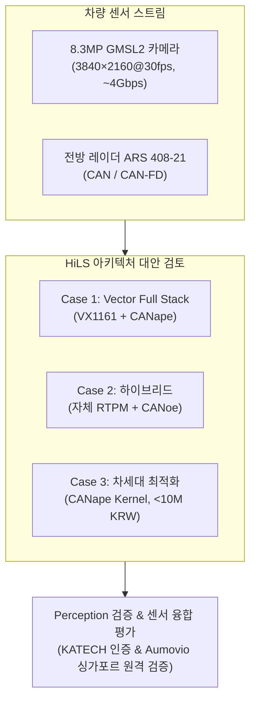

# ADAS 전방 센서 HiLS 구축 및 엔지니어링 리드 (Career Summary)

> **프로젝트 개요**: 글로벌 Tier-1(Aumovio)의 한국 내 ADAS 실차 기능시험을 **싱가포르 현지 원격 시뮬레이터(HiLS)**로 대체하기 위한 전방 카메라(8.3MP GMSL2) 및 레이더(CAN) 검증 인프라 기획·설계·기술 의사결정 총괄.

---

## 1. 핵심 역할 및 담당 업무 (Key Responsibilities)

* **HiLS 시스템 아키텍처 설계 및 요구사항 정의**
  * 8.3MP 4K GMSL2 비압축 비디오 스트림(~4 Gbps)과 ARS 408-21 전방 레이더(CAN) 간 **마이크로초($\le 1\text{ms}$) 단위 동기화(Time Synchronization)** 아키텍처 수립.
  * CANape/CANoe 기반의 데이터 취득(Logging) 및 가상 주입(Replay) 파이프라인 표준화(ASAM MDF4 규격).
* **기술 Feasibility(실현 가능성) 분석 & 아키텍처 트레이드오프 도출**
  * "Vector 상용 풀스택(VX1161+CANape)" vs "자체 기술자산(RTPM) 연동 하이브리드" 간의 정량적 비교 분석(동기화 보장성, 도입 기간, 개발 리스크, 유지보수성).
  * 모니터 재촬영 방식의 광학/지연 왜곡 문제를 기술적으로 증명하고, 카메라 프레임 하드웨어 타임스탬핑 및 SoC-MCU 간 `AppStatus` 동기화 프로토콜 직접 설계.
* **견적 검토 및 예산 최적화 (Quotation & Vendor Negotiation)**
  * 계측 벤더(Vector)와의 직접 기술 협상을 통해 초기 6,650만 원 상당의 상용 견적 내 불필요 옵션을 정밀 조정.
  * 최신 임베디드 로깅 기술(CANape Kernel on Arm64/Thor)을 선제 발굴하여 **기존 대비 80% 이상 비용을 절감하는 1,000만 원 이하 신규 대안** 제시.
  * 글로벌 반도체/SSD 수급난에 따른 3개월 이상의 납기 리스크 및 데일리 단가 변동에 대비한 구매 전략 수립.
* **글로벌 고객사 및 대외 기관 기술 협의 리드 (Stakeholder Management)**
  * **Telechips(SoC) – Aumovio(글로벌 Tier-1) – KATECH(한국자동차연구원)** 3자 기술 협의체 주도.
  * 싱가포르-한국 간 지리적 분리에 따른 해외 반출, 본사 관할 라이선스 분기, 원격 시험 체계 이슈 완결.

---

## 2. 아키텍처 Feasibility & 의사결정 비교표

| 평가 항목 | Case 1. Vector Full Stack (상용 구매) | Case 2. Hybrid (자체 RTPM + CANoe) | Case 3. CANape Kernel (차세대 대안) |
| :--- | :--- | :--- | :--- |
| **시스템 구성** | VX1161 (GMSL2) + VN1530 + CANape | Telechips RTPM + Vector CANoe | Arm64/Thor 기반 CANape Kernel |
| **Time Sync** | **Vector HW 타이머 보장 (PTP/IEEE 1588)** | 자체 검증 필요 (PTP 스택 개발 부담) | OS 레벨 하드웨어 PTP 타임스탬프 지원 |
| **비용 구조** | 로깅 ~66.6M / 리플레이 ~36.9M KRW | 로깅 ~30M+자체공수(3~4 M/M) | **1,000만 원 이하 (비용 혁신)** |
| **개발 기간** | 즉시 도입 가능 (발주~납기 3개월) | 최소 4개월 이상 (I/F 개발 및 튜닝) | 파일럿 검증 약 1~2개월 |
| **핵심 장단점** | 공신력 있는 인증 데이터 확보 / 고비용 부담 | 예산 절감 / 동기화 오차 자체 검증 리스크 | 저비용·고성능 / 최신 솔루션 검증 필요 |

---

## 3. 핵심 엔지니어링 성과 (Impact & Achievements)

1. **글로벌 원격 검증 인프라 기획 완결**: 실차 운송 및 인허가 지연 없이 해외 파트너가 국내 도로 주행 환경을 재현·검증할 수 있는 표준 HiLS 기반 마련.
2. **견적 최적화 및 최대 80% 예산 절감 대안 발굴**: 초기 고비용 상용 풀스택(약 7,000만 원)에 안주하지 않고, 자체 자산 연동 및 최신 임베디드 로깅 기술 검토를 통해 1,000만 원 이하 도입 경로 확보.
3. **센서 동기화(Time Sync) 무결성 확보 방안 정립**: 고속 주행 시 50ms 시차만으로도 1.39m 오차를 유발하는 문제를 선제 정의하고, PTP 기반 마이크로초 동기화 및 ASAM MDF4 표준 데이터 체계 수립.
4. **단계별 검증 로드맵 구축**: `Phase 1(자체 인지 모델 단독 평가)` $\to$ `Phase 2(비동기 센서 퓨전)` $\to$ `Phase 3(정밀 동기화 HiLS 퓨전)`의 3단계 검증 프로세스를 체계화하여 프로젝트 리스크 분산.

---

## 4. 보유 기술 및 핵심 역량 (Technical Skillset)

* **Validation & Simulation**: ADAS HiLS Architecture, Sensor Replay/Injection, SIL/HIL/VIL Testing Strategy
* **Tools & Standards**: Vector CANape, CANoe, CAPL, ASAM MDF4 (.mf4), PTP (IEEE 1588 / 802.1AS), XCP Protocol
* **Sensor & Hardware**: 8.3MP GMSL2 Camera (OX08BC), Millimeter-wave Radar (ARS 408-21), CAN/CAN-FD, VN5620/VX1161
* **Engineering Leadership**: Vendor Negotiation, Cross-border Partner Collaboration, Technical Feasibility & ROI Analysis
